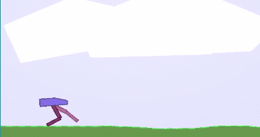

Bipedal Walker
==============

by [Allan Reyes](https://allanbreyes.github.io)

## Domain

Several recent advancements in **Reinforcement Learning** have proven
tremendously successful in scaling learning architectures beyond simple grid
games to problems of increasing complexity. While obstacles in extending
reinforcement learning broadly to real-world applications are enumerable, the
focus of this study is on addressing the challenges associated with high
dimensionality and continuous ranges of both state and action spaces.

Previous work has been conducted to use Deep Q-Networks (**DQN**) as function
approximators to address state space complexity ([Mnih 2013][5]; [Mnih 2015][4])
and Deep Deterministic Policy Gradients (**DDPG**) to address action state space
complexity ([Silver 2014][7]; [Lillicrap 2016][3]). Lastly, evolutionary
algorithms have showed extraordinary promise as alternatives to traditional
reinforcement learning paradigms ([Salimans 2017][6]). While previous studies
have empirically demonstrated generality of these new approaches, the scope of
this study attempts to synthesize, optimize, and compare these algorithms
against a single, common problem: control of a bipedal walker, using [OpenAI's
BipedalWalker-v2][BipedalWalker-v2] environment.

This study is of particular interest for two reasons. First, the control problem
itself is non-trivial due to the space complexity. And secondly, a successful
reproduction strengthens the applicability of prior research.

## Model/Problem

The environment and problem is well-defined from [OpenAI][BipedalWalker-v2]:



> Reward is given for moving forward, total 300+ points up to the far end. If
the robot falls, it gets -100. Applying motor torque costs a small amount of
points, more optimal agent will get better score. State consists of hull angle
speed, angular velocity, horizontal speed, vertical speed, position of joints
and joints angular speed, legs contact with ground, and 10 LIDAR rangefinder
measurements. There's no coordinates in the state vector.

The problem is posed as a finite-horizon, non-deterministic Markov decision
process (**MDP**), and is as interesting as it is difficult. The high
dimensionality and continuous ranges of inputs (space) and outputs (actions)
poses especially challenging examples of the lemmas of delayed reward, credit
assignment, and exploration vs. exploitation. Moreover, while the MDP might
guarantee convergence to a deterministic optimal policy in the _limit_, the
dimensionality and continuous range poses the challenge that it cannot be
enumerated in finite space complexity.

A successful learner will "solve" the reinforcement learning problem by
achieving an average reward of **300** over **100** consecutive trials. The
scope of the study will both optimize and examine the effect of hyperparameters,
_e.g. learning rates, discount, etc._, on performance. Lastly, a holistic
comparison of both the reinforcement learner and evolutionary learner will be
provided.

## Algorithms

The chief algorithms to be employed include a synthesis of **DQN** and **DDPG**
in an Actor-Critic ([Konda 2000][2]) architecture with batch normalization
([Ioffe][1]), and an application of an evolutionary strategy (**ES**) for
optimization as a surrogate for traditional reinforcement learning.

The reinforcement learning algorithm is well-defined in ([Lillicrap 2016][3]),
and borrows extensively from ([Mnih 2013][4]), using the concepts of _experience
replay_ and separate _target networks_:

```
randomly initialize critic network Q and actor μ
initialize target network Q' and μ'
initialize replay buffer R
for episode = 1, M do:
  initialize a random process N for action exploration
  receive initial observation state s1
  for t = 1, T do:
    select action a_t = μ + N_t according to current policy
    execute action a_t and observe reward r_t and new state s_t+1
    store experience in replay buffer
    sample a random minibatch of N transitions from R
    update target values according to discount, γ
    update the actor policy using the sampled policy gradient
    update the target networks
```

The evolutionary strategy (**ES**) proposed in ([Salimans 2017][6]), in brief,
applies randomized, "black box" optimization as an alternative to traditional
reinforcement learning:

```
input: learning rate α, noise standard deviation σ, initial policy parameters θ_0
for episode = 1, M do:
  for t = 1, T do:
    sample ϵ_1 ... ϵ_n
    compute returns
    update policy parameters, θ_t+1
```

## Benchmarks and Evaluation Metrics

While [OpenAI][BipedalWalker-v2] provides clear and historical benchmarks for
performance, the comparative nature of this study implies the comparison between
the reinforcement learning and evolutionary approaches. The study will attempt
an optimized, "best-effort" solution for both strategies, and compare
performance across 3 quantifiable metrics:

- Episodes taken to _solve_ the problem as posed from [OpenAI][BipedalWalker-v2]
- Time taken to _solve_
- Average reward after training

## Project Design

The algorithms will be implemented in **Python**. The reinforcement learning
environment is established and provided from the [`gym`][gym] library, and will
be imported as the primary interface used by all learning agents.
[Keras][keras], backed by [TensorFlow][tf], and [scikit-learn][sklearn] will be
used as the primary machine learning libraries. Lastly, all graphics and results
will be plotted using [`matplotlib`][matplotlib].

## References

[Ioffe, S., & Szegedy, C. (2015). Batch Normalization: Accelerating Deep Network Training by Reducing Internal Covariate Shift. Arxiv, 1–11.][1]

[Konda, V. R., & Tsitsiklis, J. N. (2000). Actor-Critic Algorithms. Nips.][2]

[Lillicrap, T. P., Hunt, J. J., Pritzel, A., Hess, N., Erez, T., Tassa, Y., … Wierstra, D. (2016). Continuous control with deep reinforcement learning. Foundations and Trends® in Machine Learning, 2][3]

[Mnih, V. et al. (2015). Human-level control through deep reinforcement learning. Nature.][4]

[Mnih, V., Silver, D., & Riedmiller, M. (2013). Playing Atari with Deep Reinforcement Learning, 1–9.][5]

[Salimans, T., Ho, J., Chen, X., & Sutskever, I. (2017). Evolution Strategies as a Scalable Alternative to Reinforcement Learning, 1–13.][6]

[Silver, D., Lever, G., Heess, N., Degris, T., Wierstra, D., & Riedmiller, M. (2014). Deterministic Policy Gradient Algorithms. Proceedings of the 31st International Conference on Machine Learning (ICML-14), 387–395.][7]

<!-- Links -->
[BipedalWalker-v2]: https://gym.openai.com/envs/BipedalWalker-v2
[gym]:              https://github.com/openai/gym
[keras]:            https://github.com/fchollet/keras
[matplotlib]:       https://matplotlib.org/
[sklearn]:          http://scikit-learn.org/stable/
[tf]:               https://www.tensorflow.org/

[1]: https://arxiv.org/abs/1502.03167
[2]: http://web.mit.edu/jnt/www/Papers/J094-03-kon-actors.pdf
[3]: https://arxiv.org/pdf/1509.02971.pdf
[4]: https://storage.googleapis.com/deepmind-media/dqn/DQNNaturePaper.pdf
[5]: https://www.cs.toronto.edu/~vmnih/docs/dqn.pdf
[6]: https://arxiv.org/pdf/1703.03864.pdf
[7]: http://proceedings.mlr.press/v32/silver14.pdf
